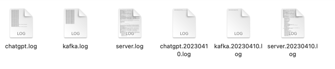

# 개인 연습용 프로젝트
# Chatgpt_Slackbot 프로젝트
## 개요
- 목표: Chatgpt_Slackbot을 만들어보며 나만의 운영 시스템을 구축하고 실제 서비스로 전환한다.
- 개발하는 이유: 간단한 프로젝트이지만 서비스의 품질을 높이기 위한 다양한 기술들을 도입해보기에 적절한 프로젝트라고 생각하여 시작하게 되었다.
- 기대효과 및 산출물:
    - 나만의 시스템을 구축하여 만들고 싶은 서비스가 있을 때 도메인 소스만 작성하면 즉시 서빙해볼 수 있다.
    - 메시징 실무에 즉시 적용하여 활용할 수 있다.
## 진행계획
- 1단계: Slack을 통해 Chatgpt에게 질의할 수 있는 Slack bot을 만든다.
- 2단계: Slackbot의 기능을 확장한다.
- 3단계: slackbot이 아닌 실제 서비스를 서빙한다. 이때는 클라이언트(프론트), 새로운 AI 모델도 도입한다.
## Jira 주소
- https://travelers.atlassian.net/jira/software/projects/TM/boards/2
## 기술 스택
### 1. Springboot
- 사용자가 Slack에서 @ChatGPTBot 멘션 후 질문을 작성하면 Slack에서 Slack Api의 Event Subscription에 등록된 action-point로 요청을 보낸다. 
- 이러한 요청을 처리하기 위한 봇 서버로 사용했다.
### 2. Kafka
- Slack Event Subscription(Mention)에 대한 비동기 이벤트 처리를 위해 사용했다.
- 멘션에 대한 Event Subscription에 대해 Slack에서 Springboot 서버로 Request를 주는데 Chatgpt의 처리를 기다린 후 응답을 주는 동기 방식을 사용하면 Slack에서 Timeout이 나면서 retry를 무한대로 하게 된다. 
- 이러한 문제를 해결하기 위해 Event Subscription을 처리하는 api에서는 Kafka Producer를 호출하여 topic에 메시지를 적재하는 역할만 하고 즉시 Slack에게 잘 받았다는 OK(200) 응답을 한다. 
- 실제 ChatGpt Api 호출은 Consumer group에서 Kafka의 메시지들을 읽어서 처리한 후 Slack에 결과를 Write해준다.
### 3. Logback
- Logback 디펜던시를 추가하고 logback-spring.xml, appender.xml을 작성하였다. 
- 우선적으로 kafka, chatgpt, springboot의 로그들을 파일로 저장하게 했다.
- 수집된 로그들은 일자별 파일로 백업하여 저장한다.
- 
### 4. Redis
- [ ] 중복되는 질문에 대한 캐싱 및 자주 받는 질문에 대한 카운트를 추가한다.
### 5. LogRotate (후순위)
- [ ] 로그를 효율적으로 관리하기 위해서 LogRotate를 도입한다.
### 6. LogStash
- [ ] Logback으로 생성한 로그 파일들을 input으로 받아 kafka에 이벤트를 적재한다.
- [ ] kafka에 저장한 이벤트를 es에 저장한다.
### 7. ElasticCache
- [ ] ElasticCache에 저장된 로그들을 Kibana에서 볼 수 있게 한다.
### 8. Kibana
- [ ] 구체사항 구상 중
### 9. K8s
- [ ] 현재 모든 기능들은 Docker 컨테이너 기반으로 동작하고 있다. 이것들을 쿠버네티스 pod로 띄워줘야 한다.
### 10. Jenkins
- [ ] 빌드 서버를 따로 두고 jar 빌드 후 이미지를 만들어서 DockerHub에 push하는 역할까지 수행한다.
### 10. ArgoCD
- [ ] k8s로 migration이 완료되면 ArgoCd를 이용하여 DockerHub 이미지를 pod에 띄워준다.
### 11. EC2
- [ ] 현재 서버는 로컬에서 ngrok를 이용한 프록시 방식으로 동작하고 있다. 이것을 AWS EC2 환경으로 포팅해줄 필요가 있다.
- [ ] 이때 주의해야할 점은 로컬 환경은 M1칩을 사용하기 때문에 Linux ARM 환경이다. 따라서 Linux AMD 환경으로 옮기게 될 경우 잘 동작하는지 확인하자.
- [ ] 레플리카를 추가하여 클러스터를 구성한다.(후순위)
### 11. Zookeeper
- [ ] Zookeeper의 값을 조작할 수 있는 웹 콘솔을 만든다. (후순위)
### 12. Ansible
- [ ] 서버를 여러대로 증설한다면 도입을 고려해본다. (후순위)
### 박스로 되어 있는 것은 앞으로 구현해야될 내용
## 문서는 따로 작성하지 않고 위 내용을 수정하거나 추가하는 방식으로 진행한다.
